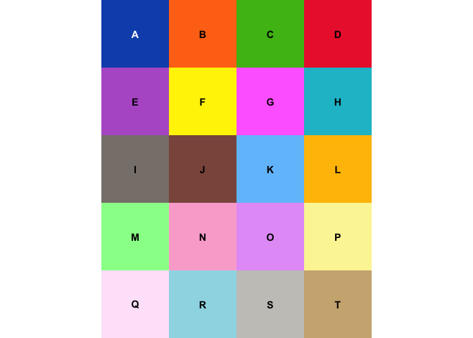
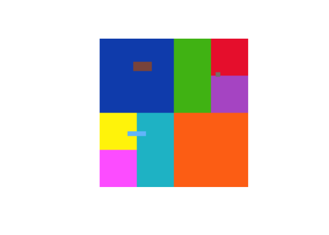
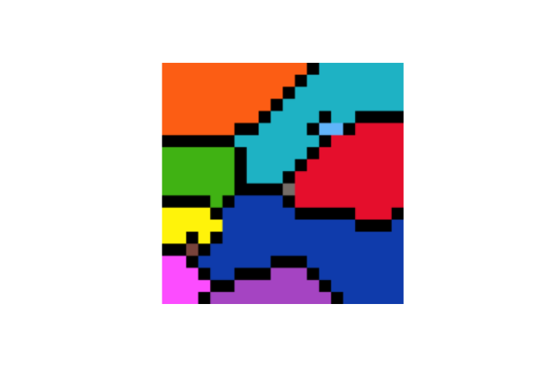

The NeuroScopeIO package provides input/output functionality to read NeuroScope learning products into an R working environment, and partial functionality to write such products back to file.  We will use a 10-dimensional SHGR cube and its associated SOM products to demonstrate this functionality.  We consider "NeuroScope" products to comprise the following list: 

* a data cube, in Khoros viff format 
* an include file (.incl)
* an nna file (.nna)
* a weight cube (.wgtcub) file, in Khoros viff format 
* a nunr file (.nunr)
* a ctab file 
* a .cadj file, in Khoros viff format. Note: $\texttt{ann-SOMconsc}$ recall produces the .cadj file in Khoros KDF format. This must be converted to viff format manually in order to import with NeuroScopeIO.  

This document demonstrates common uses of functions in the NeuroScopeIO package, but does not exercise every function in the package. Complete documentation is available (both in stanard man pdf format, as well as interactive ```?<function_name>``` format), so any of the package functions can be explored further via these help options.  

# Collect Product Paths
To make this process ".parm-file-like", collect the paths of each product to start: 


```r
data_file = "~/Google Drive/Datasets/SGRW/ds/100d/SGRW-100d_11class_cov100-500.viff"
include_file = "~/Google Drive/Datasets/SGRW/ds/SGRW_11class.incl"
nna_file = "~/Google Drive/Datasets/SGRW/ds/100d/SGRW-100d.nna"
wgtcub_file = "~/Google Drive/Datasets/SGRW/dp/100d/recall/SGRW-100d_11class_cov100-500_20x20.k3.r.5M.wgtcub"
nunr_file = "~/Google Drive/Datasets/SGRW/dp/100d/recall/SGRW-100d_11class_cov100-500_20x20.k3.r.5M.nunr"
ctab_file = "~/Google Drive/Datasets/SGRW/ds/SGRW.ctab"
cadj_file = "~/Google Drive/Datasets/SGRW/dp/100d/recall/SGRW-100d_11class_cov100-500_20x20.k3.r.5M.cadj"
```

# Importing Data Products

## Data Cubes

The function ```NeuroScopeIO::read_khoros_viff``` function accepts two arguments: $\texttt{filename}$, which is a path to the viff cube to import, and $\texttt{verbose}$, which is boolean. If ```verbose=T``` then the pixel spectra of the four "corners" of the image cube are printed to the R console window, which can be helpful for spot checking your import.  The return value is a 3d data cube (array) in R, whose (1,1) element contains the spectral from pixel (1,1) in the image, and so on.  


```r
X = NeuroScopeIO::read_khoros_viff(filename = data_file, verbose = T)
```

```
## NW corner of cube: 
## 462.905417 467.139347 451.875788 470.143694 471.996632 470.979375 467.936955 465.556848 454.161335 461.324137 473.334481 480.390168 476.443341 455.830319 441.095279 439.470836 450.961738 480.850512 476.289590 466.560884 462.860865 467.264997 484.089233 474.261554 486.349378 484.372960 479.891681 468.072284 474.292927 471.782062 483.868598 478.434114 468.879215 468.346716 452.833794 447.359703 427.077417 398.776461 380.216384 374.790575 348.339872 357.474661 332.916679 359.997571 340.321592 358.210179 324.091123 303.456471 300.628871 288.338148 263.503222 282.594167 255.035451 260.302861 253.883799 240.602632 225.290664 212.443285 182.289182 174.120390 162.650775 186.485478 178.763019 147.542179 114.733801 117.456128 130.742473 105.545154 103.464901 82.036330 92.592826 72.371775 77.521850 85.175450 92.167791 98.580697 124.111761 128.435257 123.484324 115.636858 127.543217 130.490785 141.466288 157.498058 171.175108 170.918006 195.740554 182.381542 196.591101 214.531312 207.191930 193.879978 190.255149 207.677240 208.649775 212.392919 224.380676 231.642399 276.543361 271.495172
## NE corner of cube:
## 804.353130 821.655741 816.815530 822.657375 822.450648 805.601848 822.200685 830.811183 827.041546 832.767293 825.944846 839.364013 834.869276 823.737655 814.432268 804.503943 803.779608 796.588310 798.670821 790.318693 784.744751 791.146167 801.009245 816.662559 814.140741 818.066884 812.690489 810.689387 815.818205 808.724808 821.893573 820.735058 801.044839 784.108131 789.075317 781.774846 814.079346 803.210015 807.559813 821.385192 817.622085 824.051329 836.368333 843.401587 850.989435 846.383876 850.114898 850.257265 842.692469 846.446263 842.766497 847.571531 857.199043 879.706600 900.940821 897.395227 848.706110 822.972586 825.947504 815.445740 803.970729 795.843781 799.869847 801.951392 789.700447 776.384086 775.686474 770.827268 762.089856 754.361225 739.378772 726.790127 737.537560 736.523403 721.461170 718.246825 716.523985 708.753401 706.927268 682.739599 672.664577 663.394649 649.669611 630.002057 620.684699 612.129134 600.030668 597.632300 587.545247 587.035278 579.777805 576.083087 567.581192 564.933278 550.034293 524.662899 520.251160 513.590474 510.530266 513.814873
## SW corner of cube:
## 280.030129 260.716222 258.803367 221.690254 241.651300 246.235956 251.543549 233.403980 230.835027 193.730810 177.016994 156.644714 144.477926 135.068835 125.764259 105.191458 92.236929 80.139203 72.436972 70.300643 91.903324 92.509925 94.096357 78.333645 93.671704 100.475772 92.262470 103.514698 123.040452 114.404936 126.757339 130.753625 130.243967 129.907788 142.087864 148.917770 134.056808 120.848593 130.202979 129.354758 115.521644 112.319113 113.188364 104.731765 102.296041 78.479129 87.750895 89.728023 83.484264 74.362826 102.679900 111.323660 118.301298 120.432639 128.536643 132.771810 140.690766 142.494834 140.049443 138.925918 147.589510 143.392585 117.166103 129.367752 116.532179 128.754720 147.352920 147.899061 125.857617 128.175135 137.970951 156.350251 151.187806 164.282430 158.945535 180.389709 191.766469 196.694292 189.288153 201.134070 190.844981 199.237132 216.689355 233.190282 233.894118 219.838539 218.127674 208.146557 254.117140 251.758498 237.156102 234.104744 211.507529 222.207499 258.206425 241.438460 244.611309 250.027426 268.884742 271.600647
## SE corner of cube:
## 694.161150 706.606234 717.338467 717.277809 735.129885 753.215351 747.655152 761.917667 768.672739 763.681568 760.701872 756.486393 770.528292 783.567061 793.178351 803.398597 819.174402 831.837603 850.299578 828.362206 838.557097 849.101145 865.598972 866.109841 887.573397 876.638769 884.922573 876.886232 888.223196 894.298952 908.254135 930.816295 944.785814 958.146711 955.533505 963.724754 981.737840 994.406719 1022.534010 1009.666071 1013.727413 1001.357979 1007.914503 1003.686074 1011.750063 1021.638731 1030.419643 1029.768178 1026.659460 1060.011889 1076.046751 1074.581725 1090.198474 1092.372262 1092.926026 1107.995223 1088.787906 1097.741583 1073.632139 1062.620631 1075.346016 1068.904342 1064.582176 1057.056786 1091.398096 1059.318654 1065.909417 1068.538086 1077.736985 1077.740973 1068.440847 1048.383679 1063.562894 1074.715111 1055.060139 1035.389863 1019.273709 1009.956190 1019.812581 1015.649581 1011.075110 1006.923306 1003.454606 980.933190 986.772710 986.826976 975.667198 945.313115 944.593393 936.455738 937.286261 928.866086 924.201746 909.101249 889.861282 898.314063 891.370622 881.129771 872.878963 864.187684
```

```r
str(X)
```

```
##  num [1:128, 1:128, 1:100] 463 466 466 499 485 ...
```

Note that the function ```read_khoros_viff``` is internally calling another function of the NeuroScopeIO library to read and interpret the Khoros viff header: ```read_khoros_header```. It is rarely necessary to invoke this function by itself.  

We can strip out and save the cube dimensions for later use: 

```r
img_x = ncol(X)
img_x
```

```
## [1] 128
```

```r
img_y = nrow(X)
img_y
```

```
## [1] 128
```

```r
img_z = dim(X)[3]
img_z
```

```
## [1] 100
```

Most base R functionality is built around **data matrices**, not arrays, so we need to convert the 3d cube we just imported to a data matrix. Use the command:

```r
X = NeuroScopeIO::convert_datcub_to_datmat(datcub = X)
str(X)
```

```
##  num [1:16384, 1:100] 463 489 490 467 470 ...
```
Data matrices have nrows = img_x*img_y and ncols = img_z.  The data matrix is populated in band-sequantial order (top to bottom, left to right), so that row 1 corresponds to the spectra in pixel (x=1,y=1), row 2 corresponds to pixel (x=2,y=1), and so on.  

If desired at some point, any data matrix can be converted back into a data cube via

```r
Xcube = NeuroScopeIO::convert_datmat_to_datcub(datmat = X, img_x = img_x, img_y = img_y)
str(Xcube)
```

```
##  num [1:128, 1:128, 1:100] 463 466 466 499 485 ...
```
You must supply the image x-y dimensions for this conversion.  

## Include Files 

The *.incl file associated with each data cube contains pertinent information about pixel labels and masking (that is, whether each pixel is "masked" from the training / recall process).  We import this information into R with the function $\texttt{read_incl}$, which takes a path to a .incl file, along with the image x-y dimensions as inputs: 

```r
incl = NeuroScopeIO::read_incl(filename = include_file, img_x = img_x, img_y = img_y)
str(incl)
```

```
## List of 2
##  $ masked: logi [1:128, 1:128] FALSE FALSE FALSE FALSE FALSE FALSE ...
##  $ class : chr [1:128, 1:128] "A" "A" "A" "A" ...
```
The return value of $\texttt{read_incl}$ is an R list with components: 

* **masked**, which is a matrix (nrows = img_y, ncols = img_x) whose (i,j) entry = TRUE if pixel (i,j) is maksed from processing, or FALSE otherwise 
* **class**, which is a matrix (nrows = img_y, ncols = img_x) whose (i,j) entry = the class label of pixel (i,j). If no class labels are found in the .incl file, all entries of this matrix are set = "?".  
If an application requires matching a label or mask designation to each row of the data matrix $X$, we can convert the incl matrices (which are just cubes which have a 3rd dimension size = 1) to $\texttt{convert_datcub_to_datmat}$: 


```r
vec_mask = NeuroScopeIO::convert_datcub_to_datmat(datcub = incl$masked)
str(vec_mask)
```

```
##  logi [1:16384, 1] FALSE FALSE FALSE FALSE FALSE FALSE ...
```

```r
vec_class = NeuroScopeIO::convert_datcub_to_datmat(datcub = incl$class)
str(vec_class)
```

```
##  chr [1:16384, 1] "A" "A" "A" "A" "A" "A" "A" "A" "A" "A" "A" "A" "A" "A" ...
```
$\color{red}{\text{Note}}$:  Since R follows column-major order, DO NOT just vectorize the matrices (i.e., with ```c(incl$class)```). This would result in a vector of labels in pixel order (x=1,y=1), (x=1,y=2) (i.e, along rows).  You could achieve correct behavior with ```c(t(incl$class))```, but I suggest using the built-in conversion functions for clarity.  

## nna Files 

The scaling information (from network input range to network output range) utilized during training and recall is contained in .nna files, which we load into R with 

```r
nna = NeuroScopeIO::read_nna(filename = nna_file, img_z = img_z)
str(nna)
```

```
## List of 4
##  $ input_min : num [1:100] -200 -200 -200 -200 -200 -200 -200 -200 -200 -200 ...
##  $ input_max : num [1:100] 1400 1400 1400 1400 1400 1400 1400 1400 1400 1400 ...
##  $ output_min: num 0
##  $ output_max: num 1
```
The return value of ```read_nna``` is again a list with components: 

* **input_min** the min of the network input range, by dimension (a vector of length=img_z)
* **input_max** the max of the network input range, by dimension (a vector of length=img_z)
* **output_min** the min of the network output range (a single number, usually = 0)
* **output_max** the max of the network output range (a single number, usually = 1) 

Importing .nna information is required for replicating a recall (performing BMU selection, building a CADJ matrix, etc) in R.  

# ann-SOMconsc Products 

## Weight Cubes 

Since weight cubes (*.wgtcub files) are just Khoros cubes in viff format, we can import them with the same function used to import the data cubes: 

```r
W = NeuroScopeIO::read_khoros_viff(filename = wgtcub_file, verbose = F)
str(W)
```

```
##  num [1:20, 1:20, 1:100] -0.404 -0.403 -0.406 -0.411 -0.33 ...
```
Note that, as imported, W is in internal network range, so if any comparison to the data is desired it must be mapped to data range first.  The weight cube has dimensions width = som_x and height = som_y, which we can save for later use: 

```r
som_x = ncol(W)
som_x
```

```
## [1] 20
```

```r
som_y = nrow(W)
som_y
```

```
## [1] 20
```

Ultimately we need to convert the imported array W to a data matrix as well, but there is a crucial intermediate step.  The (1,1) entry of W corresponds to the prototype vector attached to the top-left neuron of the SOM lattice.  However, NeuroScope convention for other SOM products (nunr, CADJ) begins neuron/prototype ordering at the **bottom left** corner of the lattice.  Thus, we need to flip the rows of this cube before converting to a data matrix using the function: 

```r
W = NeuroScopeIO::flip_datcub(datcub = W, flipX = F, flipY = T, flipZ = F)
```
Note the arguments flipX, flipY, and flipZ all default to F (to flip rows of a data cube, we set flipY = TRUE).  Now we can convert W to a data matrix as above: 

```r
W = NeuroScopeIO::convert_datcub_to_datmat(datcub = W)
str(W)
```

```
##  num [1:400, 1:100] 0.098 0.0974 0.0982 0.098 0.1027 ...
```

## NUNR Mapping Info 

The actual mapping formed during SOM learning is contained in the associated .nunr file, which we load into R via 

```r
nunr = NeuroScopeIO::read_nunr(filename = nunr_file, som_x = som_x, som_y = som_y, img_x = img_x, img_y = img_y)
str(nunr)
```

```
## List of 4
##  $ density     : num [1:400] 86 77 78 72 83 68 66 71 69 63 ...
##  $ class       : chr [1:400] "B" "B" "B" "B" ...
##  $ mapping     : int [1:128, 1:128] 272 334 273 292 247 230 356 248 337 345 ...
##  $ som_indexmap: int [1:20, 1:20] 381 361 341 321 301 281 261 241 221 201 ...
```

Note that the function ```read_nunr``` requires not only the path of the nunr file itself, but also the dimensions of the image cube and SOM.  This information is contained in the header of .nunr files, but I have required it here as a check.  Again, the nunr information is returned to R as a list with components: 

* **density** a vector (length = # of PEs, or som_x*som_y) containing the size of each prototype's receptive field 
* **class** a vector (length = # of PEs) containing the plurality data label of pixels mapped to each prototype 
* **mapping** a matrix (nrows = img_y, ncols = img_x) whose (i,j) entry contains the index of the PEto which pixel (i,j) is mapped.  For this purpose, PE indices are treated as linear indices (not array indices), and range from 1 to som_x*som_y.  
* **som_indexmap** a matrix(nrows = som_y, ncols = som_x) whose (i,j) entry contains the linear index of the (i,j) neuron on the SOM lattice.  The information in this matrix can be merged with that in the mapping matrix to determing the (x,y) neuron location to which a data vector is mapped, if desired. 

## Color Tables

Color table information is contained in .ctab files, which can be loaded with 

```r
ctab = NeuroScopeIO::read_ctab(filename = ctab_file)
str(ctab)
```

```
## 'data.frame':	20 obs. of  4 variables:
##  $ class: chr  "A" "B" "C" "D" ...
##  $ R    : num  15 255 76 237 182 255 255 23 136 140 ...
##  $ G    : num  82 116 187 41 96 242 111 190 128 86 ...
##  $ B    : num  186 23 23 57 205 0 255 207 123 75 ...
```

The color table is returned to R as a data frame with columns: 

* **class** the set of distinct labels for pixels in the data cube
* **R**, **G**, **B** which are the RGB color components associated with each label. 

Note that no assumption is made to the completeness of the ctab (i.e., whether it is missing color specifications for labels found in incl$class). The above function merely reads the information as it exists in a .ctab file.  

## CADJ 

CADJ matrices are stored in .cadj files which are Khoros KDF formatted.  **For use in R, .cadj files must be converted to viff format** with kformats.  Once this conversion is complete, we can read the CADJ with the viff reader: 

```r
CADJ = NeuroScopeIO::read_khoros_viff(filename = cadj_file, verbose = F)
str(CADJ)
```

```
##  int [1:400, 1:400, 1] 0 34 0 0 0 0 0 1 0 0 ...
```
Note that the above imported CADJ as a 3d cube, whose 3rd dimension has size = 1.  It is generally easier to work with matrices in R, so we can drop the third dimension

```r
CADJ = CADJ[,,1]
```
Since the CONN matrix is also of frequent use, I suggest building it from the CADJ import immediately: 

```r
CONN = CADJ + t(CADJ)
```

# Importing a Complete Product Suite 

The above examples demonstrate import of NeuroScope products individually, but often we would like the entire product suite brought into an R environment. This can be accomplished with the helper function: 

```r
SHGRSOM = NeuroScopeIO::load_SOM_products(data_file = data_file, include_file = include_file, nna_file = nna_file, wgtcub_file = wgtcub_file, nunr_file = nunr_file, ctab_file = ctab_file, cadj_file = cadj_file)
```

```
## Loading NeuroScope products ...
## ++ data cube ... done
## ++ include file ... done
## ++ nna file ... done
## ++ weight cube ... done
## ++ weight cube scaling ... done
## ++ nunr file ... done
## ++ lattice coords ... done
## ++ ctab file ... done
## ++ cadj file ... done
```

```r
str(SHGRSOM)
```

```
## List of 14
##  $ X             : num [1:16384, 1:100] 463 489 490 467 470 ...
##  $ img_x         : int 128
##  $ img_y         : int 128
##  $ img_z         : int 100
##  $ incl          :List of 2
##   ..$ masked: logi [1:128, 1:128] FALSE FALSE FALSE FALSE FALSE FALSE ...
##   ..$ class : chr [1:128, 1:128] "A" "A" "A" "A" ...
##  $ nna           :List of 4
##   ..$ input_min : num [1:100] -200 -200 -200 -200 -200 -200 -200 -200 -200 -200 ...
##   ..$ input_max : num [1:100] 1400 1400 1400 1400 1400 1400 1400 1400 1400 1400 ...
##   ..$ output_min: num 0
##   ..$ output_max: num 1
##  $ W             : num [1:400, 1:100] -43.2 -44.1 -42.8 -43.2 -35.7 ...
##  $ som_x         : int 20
##  $ som_y         : int 20
##  $ nunr          :List of 4
##   ..$ density     : num [1:400] 86 77 78 72 83 68 66 71 69 63 ...
##   ..$ class       : chr [1:400] "B" "B" "B" "B" ...
##   ..$ mapping     : int [1:128, 1:128] 272 334 273 292 247 230 356 248 337 345 ...
##   ..$ som_indexmap: int [1:20, 1:20] 381 361 341 321 301 281 261 241 221 201 ...
##  $ lattice_coords: int [1:400, 1:2] 1 2 3 4 5 6 7 8 9 10 ...
##   ..- attr(*, "dimnames")=List of 2
##   .. ..$ : NULL
##   .. ..$ : chr [1:2] "x" "y"
##  $ ctab          :'data.frame':	20 obs. of  4 variables:
##   ..$ class: chr [1:20] "A" "B" "C" "D" ...
##   ..$ R    : num [1:20] 15 255 76 237 182 255 255 23 136 140 ...
##   ..$ G    : num [1:20] 82 116 187 41 96 242 111 190 128 86 ...
##   ..$ B    : num [1:20] 186 23 23 57 205 0 255 207 123 75 ...
##  $ CADJ          : int [1:400, 1:400] 0 34 0 0 0 0 0 1 0 0 ...
##  $ CONN          : int [1:400, 1:400] 0 72 0 0 0 0 0 2 0 0 ...
```
The function ```load_SOM_products``` is just a wrapper which calls each step of the above under the hood.  Its return value is an R list with component names as above. The conversion of both the data and weight cubes to their respective matrices is done internally (along with the row reordering of W discussed above). List elements can be accessed via the ```$```, e.g., to return the data matrix

```r
str(SHGRSOM$X)
```

```
##  num [1:16384, 1:100] 463 489 490 467 470 ...
```
One caveat here is that, if nna_file is given, the prototype matrix is mapped from network range to input range.  

Note that not all inputs to ```load_SOM_products```  are required. If, for example, you only wish to import the data cube, you can specify the data_file path and leave the others blank 

```r
str(NeuroScopeIO::load_SOM_products(data_file = data_file))
```

```
## Loading NeuroScope products ...
## ++ data cube ... done
## ++ include file ... skipped (given as null)
## ++ nna file ... skipped (given as null)
## ++ weight cube ... skipped (given as null)
## ++ nunr file ... skipped (given as null)
## ++ lattice coords ... skipped (must supply wgtcub_file to compute lattice coords)
## ++ ctab file ... skipped (given as null)
## ++ cadj file ... skipped (given as null)
## List of 4
##  $ X    : num [1:16384, 1:100] 463 489 490 467 470 ...
##  $ img_x: int 128
##  $ img_y: int 128
##  $ img_z: int 100
```


# Visualizations

Minor visualization capabilities exist within the package, mostly for checking the integrity of the imported information.  For example, once imported, a color table can be viewed: 

```r
NeuroScopeIO::vis_ctab(ctab = ctab, label.cex = 0.9, label.font = 2, nrows_in_display = NULL)
```

<!-- -->
The label.cex argument controls the size of each label as plotted in its square, and the label.font controls whether the label is printed in bold (=2) or regular face (=1).  nrows_in_display allows manually setting the number of rows in the visualized table. If not given, this defaults to NULL, which is a flag for the function to pick its own visualized table dimensions.  

For labeled data, class maps can be visualized with 

```r
NeuroScopeIO::vis_classmap(class_matrix = incl$class, ctab = ctab)
```

```
## Warning in as.cimg.array(RGBarray): Assuming third dimension corresponds to
## colour
```

<!-- -->
The argument class_matrix must contain class labels for each pixel (and be in "image" format, i.e., with dimensions = image dimension).  This obviously requires import of the include and ctab information.

PE plurality labels of the SOM can be visualized in the same manner by converting the nunr class information back to a cube: 

```r
som_labels = NeuroScopeIO::convert_datmat_to_datcub(datmat=nunr$class, img_x = som_x, img_y = som_y)
NeuroScopeIO::vis_classmap(class_matrix = som_labels, ctab = ctab, pixel_expansion_factor = 5)
```

```
## Warning in as.cimg.array(RGBarray): Assuming third dimension corresponds to
## colour
```

<!-- -->

The additional argument pixel_expansion_factor enlarges each pixel defined in the class_matrix by its value. This is helpful for visualizing SOM labels, as SOM lattices are typically small (and the resulting plot hard to see).  


